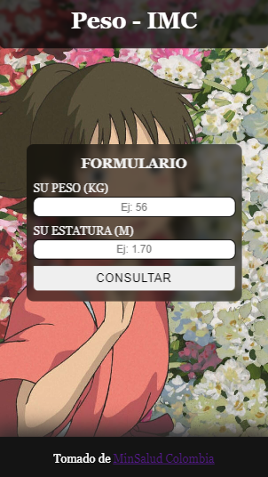

# PesoSaludable  IMC

Consultar el estado de su IMC


## Demo

[Click - Pagina Web](https://neudam.github.io/PesoSaludable-IMC)


## Desplegar Localmente

Clonar el repositorio

```bash
  git clone https://github.com/NeuDam/PesoSaludable-IMC
```

Entrar a la carpeta

```bash
  cd PesoSaludable-IMC
```

Instalar las dependencias

```bash
  npm install
```

Arrancar servidor

```bash
  npm run dev
```


## Screenshots




## Tech Stack

**Client:** React

**Server:** Node


## Authors

- [Alex](https://www.github.com/neudam)

